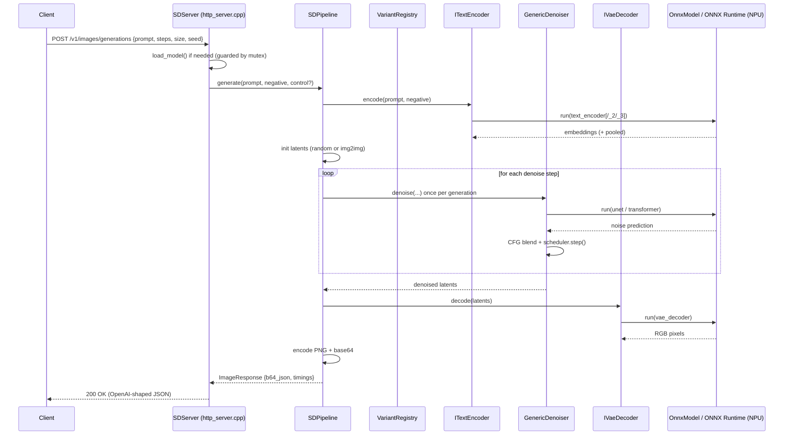

# Ryzen AI SD Server — C++ Architecture & Flow

This document explains how the C++ Stable Diffusion inference server
(`ryzenai-sd-server`) is structured and how a request flows through it, from the
HTTP layer down to the ONNX Runtime sessions running on the AMD Ryzen AI NPU.

> Scope: this is the native C++ engine. It is a self-contained HTTP server with
> no Python/PyTorch/diffusers dependency — only ONNX Runtime (vendored headers +
> the runtime `.lib`/DLLs) and a couple of header-only libraries.

---

## 1. High-level picture

The server exposes an OpenAI-compatible HTTP API. A request selects/loads a
model, then runs the classic three-stage diffusion pipeline:

**text encode → iterative denoise → VAE decode**, followed by PNG + base64
encoding of the result.

The design rests on three ideas:

1. **A self-registering variant registry** — each model family (SD1.5, SDXL,
   SD3/3.5, …) is described once by a `VariantDescriptor` that carries its
   defaults, on-disk layout, auto-detection heuristic, and factory functions.
2. **Strategy interfaces** — `ITextEncoder`, `IDenoiser`, `IVaeDecoder` abstract
   the per-variant behavior so the orchestrator (`SDPipeline`) is variant-agnostic.
3. **A single metadata-driven denoiser** — `GenericDenoiser` runs the sampling
   loop for every variant by binding model inputs from the ONNX graph's own
   input names and dtypes.

---

## 2. Directory layout (the parts that matter)

| Path | Role |
|------|------|
| [ryzenai-sd-server/src/main.cpp](ryzenai-sd-server/src/main.cpp) | Entry point, CLI args, starts the HTTP server |
| [ryzenai-sd-server/src/http_server.cpp](ryzenai-sd-server/src/http_server.cpp) | HTTP endpoints, model load/switch, request→pipeline glue |
| [ryzenai-sd-server/src/sd_pipeline.cpp](ryzenai-sd-server/src/sd_pipeline.cpp) | `SDPipeline` — orchestrates the full generation flow |
| [ryzenai-sd-server/src/variant_registry.cpp](ryzenai-sd-server/src/variant_registry.cpp) | Registry: detection, component discovery, factory dispatch |
| [ryzenai-sd-server/src/onnx_model.cpp](ryzenai-sd-server/src/onnx_model.cpp) | `OnnxModel` — thin ONNX Runtime session wrapper (NPU/DD custom ops) |
| [ryzenai-sd-server/src/scheduler.cpp](ryzenai-sd-server/src/scheduler.cpp) | Samplers (Euler Discrete, Flow-Match Euler) |
| [ryzenai-sd-server/src/controlnet_runner.cpp](ryzenai-sd-server/src/controlnet_runner.cpp) | Optional ControlNet block computation (SD3) |
| [ryzenai-sd-server/src/variants/generic_denoiser.cpp](ryzenai-sd-server/src/variants/generic_denoiser.cpp) | Unified denoiser for all variants |
| `ryzenai-sd-server/src/variants/*_variant.cpp` | Per-family descriptors (registration only) |
| `ryzenai-sd-server/src/variants/*_text_encoder.cpp` / `*_vae_decoder.cpp` | Per-family encode/decode strategies |

Headers live under [ryzenai-sd-server/include/sd/](ryzenai-sd-server/include/sd).

---

## 3. Request lifecycle

### 3.1 HTTP endpoints

Defined in [ryzenai-sd-server/src/http_server.cpp](ryzenai-sd-server/src/http_server.cpp):

| Method & path | Purpose |
|---------------|---------|
| `GET /health` | Liveness + whether a model is loaded |
| `GET /v1/internal/model_info` | Currently loaded model metadata |
| `POST /v1/internal/load` | Load / switch the active model |
| `POST /v1/images/generations` | Text-to-image (OpenAI-compatible) |
| `POST /v1/images/edits` | Image-to-image / edits |

A single `SDPipeline` instance is held behind a `pipeline_mutex_`; requests are
serialized so the NPU sessions are used by one generation at a time. Loading the
same model path again is a no-op (the existing pipeline is reused); switching
models tears down the old pipeline before constructing the new one.

### 3.2 Sequence



---

## 4. Model loading & variant selection

When a model path is loaded, `SDPipeline` initializes in this order
(see the private `load_*` methods in [ryzenai-sd-server/src/sd_pipeline.cpp](ryzenai-sd-server/src/sd_pipeline.cpp)):

1. **Session options** — configure ONNX Runtime and the NPU/Dynamic-Dispatch
   custom ops path (global, set once via `set_custom_ops_path`).
2. **Variant detection** — `VariantRegistry::detect()` scans the model directory.
   Every registered descriptor's `detect()` returns a priority score (0 = no
   match); the highest score wins. This is how SDXL is told apart from SDXL-Turbo,
   or SD3 from SD3.5 (path substrings like `turbo`, `3.5`, presence of
   `text_encoder_2` / `normal/transformer`, etc.).
3. **Component discovery** — for the chosen descriptor, each `ComponentSpec`'s
   `search_paths` are probed in order to locate the actual `.onnx` files
   (e.g. `unet/dd/replaced.onnx`), populating `config.component_paths`.
4. **ONNX model load** — each discovered component becomes an `OnnxModel`
   (an ORT `Session`) stored in `components_` keyed by `ComponentType`.
5. **Factory dispatch** — the descriptor's factory functions build the
   variant's `ITextEncoder`, `IDenoiser`, and `IVaeDecoder`, plus the
   `Scheduler` and optional `ControlNetRunner`.

### The variant descriptor

`VariantDescriptor` (in [ryzenai-sd-server/include/sd/variant_registry.h](ryzenai-sd-server/include/sd/variant_registry.h))
is the single source of truth for a family:

```text
identity      : name, aliases, ModelVariant enum
defaults      : width, height, steps, guidance, latent_channels, scheduler
layout        : has_common_dir, sub_model_dir, components[] (search paths)
detect()      : directory -> priority score
factories     : create_encoder, create_denoiser, create_vae_decoder
```

Descriptors self-register at startup via the `REGISTER_VARIANT(make_fn)` macro,
which runs a file-scope static initializer. **Adding a variant therefore requires
no edits to existing files** — only a new `*_variant.cpp` plus its source in
`CMakeLists.txt`.

---

## 5. The three pipeline stages

`SDPipeline::generate()` (in [ryzenai-sd-server/src/sd_pipeline.cpp](ryzenai-sd-server/src/sd_pipeline.cpp))
drives the flow. Notably, it reads the **model's compiled input shape** to
determine native latent dimensions (Dynamic-Dispatch models have fixed shapes),
so output size follows the model rather than the request when they disagree.

### Stage 1 — Text encode
`text_encoder_->encode(prompt, negative_prompt)` returns text embeddings and, for
SDXL/SD3, pooled embeddings. Variant encoders own the tokenization (CLIP, and T5
where applicable) and the encoder ONNX runs.

### Stage 2 — Denoise
Latents are initialized:
- **txt2img**: pure Gaussian noise seeded by `config_.seed`.
- **img2img** (`/v1/images/edits`): the input image is VAE-encoded to latents,
  then noised to the sigma of a chosen `start_step` (the formula differs by
  scheduler: additive for Euler, linear-interpolation for Flow-Match). The
  denoiser then starts partway through the schedule.

`SDPipeline::denoise()` simply delegates to `denoiser_->denoise(...)`. All the
per-step work lives in `GenericDenoiser` (see §6).

### Stage 3 — VAE decode
`vae_decoder_->decode(latents, h, w)` runs the VAE decoder ONNX and returns RGB
pixels, which are then PNG-encoded and base64-wrapped into the response.

Per-stage timings are recorded in `GenerationTiming` and returned to the client.

---

## 6. The unified denoiser (`GenericDenoiser`)

Historically each family had its own `denoise()` method — ~130 near-identical
lines triplicated across SD1.5/SDXL/SD3. These were replaced by one
implementation:
[ryzenai-sd-server/src/variants/generic_denoiser.cpp](ryzenai-sd-server/src/variants/generic_denoiser.cpp)
and its header
[ryzenai-sd-server/include/sd/variants/generic_denoiser.h](ryzenai-sd-server/include/sd/variants/generic_denoiser.h).

### 6.1 What varies is now data, not code

Every per-family difference reduces to a `DenoiserSpec`:

```cpp
struct DenoiserSpec {
    ComponentType component; // UNET (SD1.5/SDXL) or TRANSFORMER (SD3)
    int seq_len;             // encoder_hidden_states dim 1
    int embed_dim;           // encoder_hidden_states last dim
    int pool_dim;            // pooled projection dim (0 = none)
    int latent_ch;           // latent channels (4 or 16)
};
```

The variant `*_variant.cpp` files just pass a spec, e.g.:

- SD1.5: `{UNET, 77, 768, 0, 4}` (SD-Turbo uses `1024` embed_dim)
- SDXL: `{UNET, 77, 2048, 1280, 4}`
- SD3/3.5: `{TRANSFORMER, 160, 4096, 2048, 16}` (+ ControlNet runner)

### 6.2 The shared sampling loop (once)

For each step, `GenericDenoiser::denoise()`:

1. Duplicates the latent for classifier-free guidance (batch = 2 when
   `guidance_scale > 1`).
2. Applies `scheduler.scale_model_input()`.
3. (SD3 only) runs the ControlNet pre-step if a runner + control image exist.
4. Builds inputs (§6.3) and calls `model_->run(inputs)`.
5. Converts the noise prediction to fp32 (handling fp16 outputs).
6. Applies CFG: `pred = uncond + scale * (cond - uncond)`.
7. Calls `scheduler.step()` to advance the latents.

### 6.3 Metadata-driven input binding

Instead of hard-coding input order/dtype per family, `build_inputs()` iterates
the model's own declared inputs and dispatches by **name**:

| Rule | Bound to |
|------|----------|
| index 0 | latent sample (`sample` / `hidden_states`) |
| name contains `controlnet` | ControlNet block (runner output or zeros) |
| name contains `encoder_hidden_states` | text embeddings |
| name contains `pooled` / `text_embeds` | pooled embeddings |
| name contains `time_ids` | SDXL micro-conditioning `[h,w,0,0,h,w]` |
| name contains `timestep` / `t` | broadcast timestep |
| otherwise | zero tensor of the declared shape |

Each binding goes through one helper, `emit()`, which converts a `float` source
buffer into a tensor of **whatever dtype the model declares**
(`fp32` / `fp16` / `int64` / `double`), zero-padding or truncating to the target
element count. This is why SD3's all-fp16 transformer and the fp32 UNets share
the same code path with no dtype branches at the call sites.

**Buffer lifetime:** ORT tensors reference external memory, so the backing
buffers must outlive `run()`. `GenericDenoiser` keeps a `Scratch` arena of
`std::deque`s — `std::deque` never relocates existing elements on `push_back`,
so pointers handed to ORT stay valid until the tensors are consumed.

The only genuinely family-specific logic that remains (SDXL `time_ids`, SD3
ControlNet block layout) lives in exactly one place each, selected by input name
— so adding a new model with conventional input names needs **no new denoiser
code**.

---

## 7. Supporting components

- **`OnnxModel`** ([ryzenai-sd-server/include/sd/onnx_model.h](ryzenai-sd-server/include/sd/onnx_model.h)):
  wraps an ORT `Session`, caches input/output names, and exposes
  `get_input_shape()`, `get_input_type()`, and `run()`. It hides the NPU /
  Dynamic-Dispatch custom-ops registration behind a simple call surface.

- **`Scheduler`** ([ryzenai-sd-server/src/scheduler.cpp](ryzenai-sd-server/src/scheduler.cpp)):
  implements the samplers (`EULER_DISCRETE`, `FLOW_MATCH_EULER`), including
  `set_timesteps`, `sigmas`, `scale_initial_latents`, `scale_model_input`, and
  `step`. The denoiser is scheduler-agnostic.

- **`ControlNetRunner`** ([ryzenai-sd-server/include/sd/controlnet_runner.h](ryzenai-sd-server/include/sd/controlnet_runner.h)):
  optional; computes the SD3 transformer's ControlNet block inputs from a control
  image. It is only engaged when the model declares `block_controlnet_hidden_states_*`
  inputs and a control image is supplied.

---

## 8. Concurrency & lifetime

- One active `SDPipeline` at a time, protected by `pipeline_mutex_`.
- Generation requests are serialized (the NPU is a single shared resource).
- Model switching constructs the new pipeline, then swaps it in under the lock,
  ensuring the previous NPU/DD sessions are torn down before the new ones init.

---

## 9. Adding a new variant

1. Add `src/variants/<name>_variant.cpp` defining a `make_<name>_descriptor()`
   and calling `REGISTER_VARIANT(make_<name>_descriptor)`.
2. Provide a text encoder and VAE decoder strategy (or reuse an existing one).
3. For denoising, **reuse `GenericDenoiser`** — just pass a `DenoiserSpec`. Only
   write custom code if the model needs a truly new input role.
4. Add the new `.cpp` file(s) to `SOURCES` in
   [ryzenai-sd-server/CMakeLists.txt](ryzenai-sd-server/CMakeLists.txt).

No existing files need to change for detection or dispatch — the static
registration and name-driven binding pick it up automatically.

---

## 10. Build

```powershell
# from ryzenai-sd-server/
.\build.bat "C:\Program Files\RyzenAI\1.7.1\onnxruntime"
```

Only the ONNX Runtime import library and runtime DLLs are needed externally; the
ORT headers are vendored under `include/onnxruntime/`. The output is a single
`build/bin/Release/ryzenai-sd-server.exe`.
